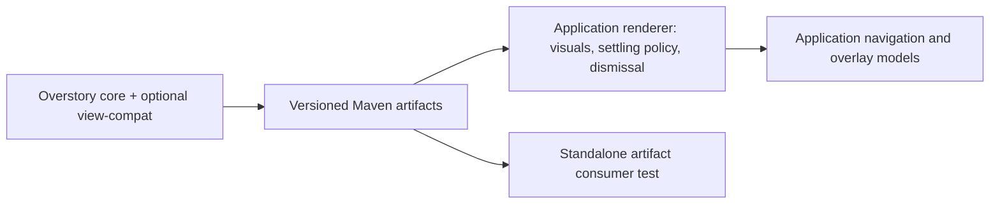

# Overstory

Sheets, modals, and anchored overlays for Jetpack Compose.

Overstory provides overlay hosting, keyed state and lifecycle, focus and input handling,
placement, and sheet gestures. Applications supply visual design and navigation.
The API is experimental.

## Modules

- `xyz.block.overstory:core`: Compose host, focus, scrim, anchor registration, placement,
  and two-anchor sheet mechanics.
- `xyz.block.overstory:view-compat`: optional Android View saved-state integration, built
  on core. Compose-only applications need only core.

The Kotlin packages are `com.squareup.ui.compose.overlays` and
`com.squareup.ui.compose.overlays.viewcompat`.



See the [engine guide](docs/engine-guide.md) and the
[saved-state compatibility decision](docs/saveable-registry.md).

## Build and test

Requires Java 21 and Android SDK 35. Set `ANDROID_HOME` to your SDK installation to configure
both Gradle builds. Alternatively, set `sdk.dir` in both `local.properties` at the repository root
and `consumer-test/local.properties`; these files are untracked. The consumer is a separate Gradle
build and does not read the root build's `local.properties`.
Install `platform-tools`, `platforms;android-35`, and `build-tools;35.0.0` with the Android SDK Manager.
Minimum Android version is API 24; bytecode targets Java 11.
The supported dependency baseline is Kotlin 2.3.21, Compose 1.9.5, lifecycle 2.9.4,
savedstate 1.3.3, Android Gradle Plugin 8.13.2, and Gradle 9.5.0.
Dependencies resolve from Google Maven and Maven Central; Gradle plugins also use the Gradle Plugin Portal.
No publishing credentials are needed to build or test.

```sh
./gradlew testDebugUnitTest checkKotlinAbi ktfmtCheck lintRelease assembleDebugAndroidTest
./gradlew -Pversion=0.1.0-SNAPSHOT publishAllPublicationsToStagingRepository
./gradlew -p consumer-test -PoverstoryVersion=0.1.0-SNAPSHOT assembleDebug assembleDebugAndroidTest

# With a connected device or emulator (API 24+); select it with ANDROID_SERIAL.
./gradlew :core:connectedDebugAndroidTest :view-compat:connectedDebugAndroidTest
./gradlew -p consumer-test -PoverstoryVersion=0.1.0-SNAPSHOT connectedDebugAndroidTest
```

Device tests exercise animations, so leave the device's animation scales enabled.
GitHub Actions runs these checks with an API 35 emulator.

`consumer-test` is a separate Gradle build. It resolves Maven artifacts from `build/repository`,
never project dependencies or included builds. Its smoke test opens an overlay, edits text,
recreates the Activity, verifies restored text, and dismisses the overlay. Library modules contain
portable behavior tests; applications should test their own rendering and navigation policies.

## Using a local build

See [artifact staging and releases](docs/publishing.md) for local builds and signed Maven Central
releases. Use a version that has completed publication; repository tags alone do not guarantee
that artifacts are available.

## Project resources

- [Contributing](CONTRIBUTING.md)
- [Releasing](RELEASING.md)
- [Code owners](CODEOWNERS)
- [Governance](GOVERNANCE.md)
- [Code of conduct](https://github.com/block/.github/blob/main/CODE_OF_CONDUCT.md)
- [Apache 2.0 license](LICENSE)

## Acknowledgments

Overstory builds on the Compose overlay implementation originally developed by
[Keith Abdulla (@ekeitho)](https://github.com/ekeitho), beginning in 2024. Keith authored
most of that original implementation, which formed the foundation of this library.

## License

    Copyright 2024-2026 Block, Inc.

    Licensed under the Apache License, Version 2.0 (the "License");
    you may not use this file except in compliance with the License.
    You may obtain a copy of the License at

       http://www.apache.org/licenses/LICENSE-2.0

    Unless required by applicable law or agreed to in writing, software
    distributed under the License is distributed on an "AS IS" BASIS,
    WITHOUT WARRANTIES OR CONDITIONS OF ANY KIND, either express or implied.
    See the License for the specific language governing permissions and
    limitations under the License.
