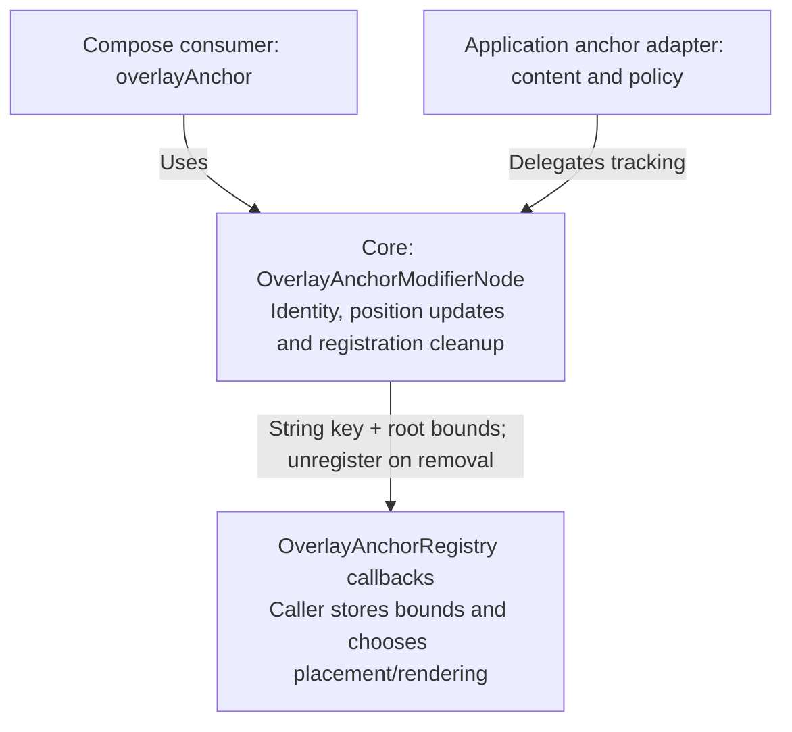
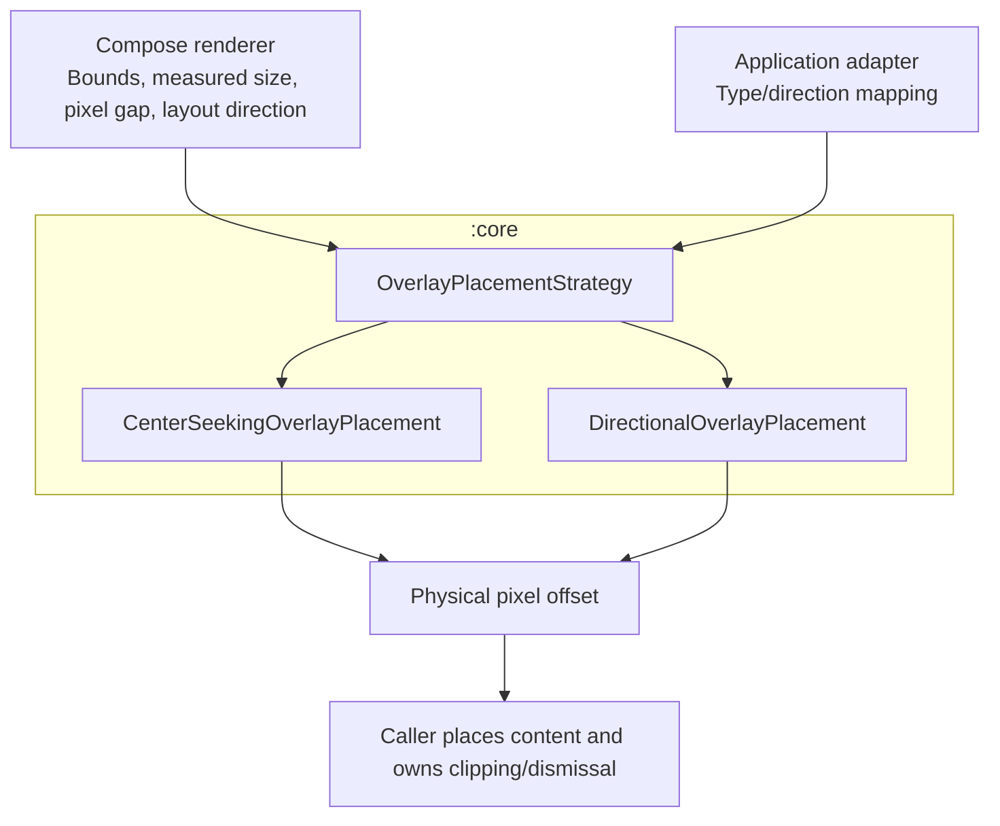
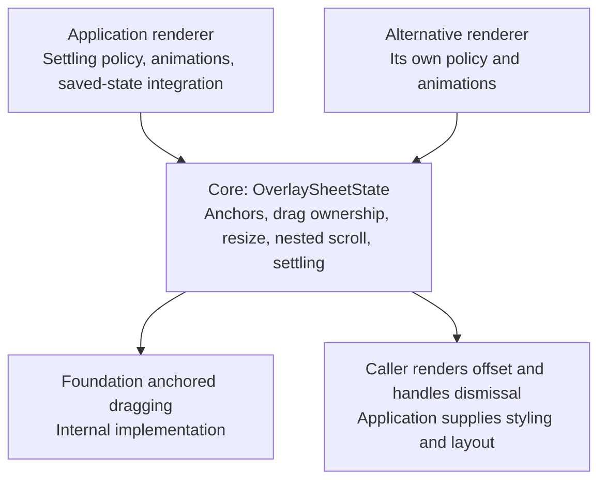

# Compose Overlays engine

These experimental Android modules contain reusable overlay behavior. Applications supply models,
visuals, input policy, and dismissal callbacks. Applications own navigation and the overlay list.

## Choose a host

| Consumer | Host | State provided per entry |
| --- | --- | --- |
| Compose content | `OverlayHost` in `:core` | Compose saveable state and a capped `LocalLifecycleOwner` |
| Content containing Android Views or nested AndroidX saved-state owners | `ViewCompatibleOverlayHost` in `:view-compat` | Core state plus a scoped `LocalSavedStateRegistryOwner` |

`ViewCompatibleOverlayHost` delegates to `OverlayHost`. The compatibility module only adds the
AndroidX saved-state registry; it does not have another stack loop or lifecycle implementation.
The core module requires no application framework or custom View saved-state integration.

```kotlin
@OptIn(ExperimentalComposeOverlaysApi::class)
@Composable
fun Dialogs(dialogs: List<DialogModel>) {
  OverlayHost(
    overlays = dialogs,
    keyOf = { it.id },
    coveredContent = { MainContent() },
  ) { dialog, isTopmost ->
    DialogContent(dialog, isTopmost)
  }
}
```

Use the View-compatible host with the same arguments when needed. The renderer supplies scrims,
focus and pointer policy, layout, and Back handling; the host does not choose those policies.

## Focus

`Modifier.overlayFocusTarget` makes an overlay a focus target and lets an entry claim initial focus,
usually the topmost one. Wrap content that an overlay can cover, such as `coveredContent` and lower
entries, in `Modifier.overlayFocusLayer`, and tell it whether the overlays above block that content.
A covered layer releases focus and keeps focus out of its content. Once it is uncovered, it restores
the descendant that had focus. If there is none to restore, its overlay focus targets request
initial focus again.

## Identity, state, and lifecycle

- Entries render in list order, from bottom to top. Keys must be stable, unique in the current
  stack, and saveable by the enclosing Compose registry.
- Reordering preserves each entry's composition, saveable state, and lifecycle owner.
- Removing an entry destroys its lifecycle and deletes its saved-state namespace. Re-adding the
  same key starts fresh.
- Host recreation restores state for keys supplied again by the caller. The host does not save
  or restore the caller's navigation models.
- The default lifecycle cap is `CREATED` for covered entries and `RESUMED` for the top entry.
  Custom policies may return `CREATED`, `STARTED`, or `RESUMED`. An entry also follows its parent's
  lifecycle and can never resume after destruction.
- View registry restoration happens before the entry lifecycle activates. Embedded View content
  sees the requested cap immediately, without briefly resuming covered entries.

`OverlayHost.overlayContentWrapper` is an advanced integration point used by the optional View
adapter. It runs inside the entry's saveable-state namespace and lifecycle scope. On first creation,
the lifecycle is `INITIALIZED` while the wrapper prepares its registry, then activates before the
wrapped content renders. The wrapper must invoke its content exactly once in the same composition
and keep its composition structure stable while the entry remains present.

`ViewCompatibleOverlayHost` attaches the View registry to the shared host's state and lifecycle
scopes through its private `ViewSavedStateRegistry` implementation.

Replacing the parent lifecycle owner recreates the View adapter's content subtree. Compose saveable
state and registered Android View state are restored before the new factories run, so providers
register against the new owner.

This bridge currently relies on Compose's composite-key hashing to preserve saveable identities
while recreating content. Its private workaround, rejected stable-registry prototype, and required
Compose-upgrade checks are documented in the
[saved-state decision](saveable-registry.md).

## Anchor registration

`Modifier.overlayAnchor(registry, enabled)` reports a layout's bounds to an
`OverlayAnchorRegistry`. The registry is a callback contract: consumers own storage, associated
overlay content, placement, and dismissal. A Compose-only consumer can collect the bounds directly:

```kotlin
val bounds = remember { mutableStateMapOf<String, Rect>() }
val registry = remember {
  object : OverlayAnchorRegistry {
    override fun registerAnchor(key: String, boundsInRoot: Rect) {
      bounds[key] = boundsInRoot
    }

    override fun unregisterAnchor(key: String) {
      bounds.remove(key)
    }
  }
}
Box(Modifier.overlayAnchor(registry)) { AnchorContent() }
```

- Bounds are pixels in the Compose root, with the clipping semantics of `boundsInRoot()`. The
  consumer must use the same coordinate space or convert before placement; the core applies no
  window-inset, padding, or placement policy.
- Each live anchor gets an opaque String key that stays stable while it moves, resizes, or changes
  registry. Replacing the registry unregisters from the previous owner first.
- Disabling, detaching, or reusing the node ends its registration. Re-enabling or reusing it starts
  with a new key, even when its bounds are unchanged. Keys are transient across host recreation.
- Adapters can delegate `OverlayAnchorModifierNode` to resolve their own CompositionLocals and
  call `update` to republish stationary metadata. Adapters retain content and dismissal policy
  while core owns identity and position tracking. Applications should distinguish initial
  registration from updates if moving an anchor must not reopen a dismissed overlay.



## Placement strategies

`OverlayPlacementStrategy` is a pure coordinate calculation. The caller supplies the anchor bounds,
available bounds, measured overlay size, and layout direction; the result is a physical top-left
`Offset`. Every value uses pixels in the same coordinate space. The available rectangle can have a
nonzero origin. Convert dimensions to pixels and account for insets before calling the strategy.

```kotlin
val placement: OverlayPlacementStrategy =
  DirectionalOverlayPlacement(OverlayPlacementPreference.End)
val topLeftPx = placement.calculatePosition(
  anchorBounds = anchorBounds,
  availableBounds = availableBounds,
  overlaySize = measuredOverlaySize,
  layoutDirection = layoutDirection,
)
```

- `CenterSeekingOverlayPlacement(gapPx)` grows toward the available area's center. Center ties grow
  down and toward logical end. The signed pixel gap is applied after vertical edge adjustment.
- `DirectionalOverlayPlacement(preference)` tries a preferred side, then its opposite on the same
  axis. `Any` tries above, below, start, then end. Start/end and horizontal alignment mirror in RTL.
  Cross-axis fit is checked from the aligned start/top edge before changing alignment.
- Both strategies provide best-effort placement. Oversized content, offscreen anchors, and gaps may
  produce positions outside the available area; callers own clipping and overflow handling.
- Strategies handle geometry only. A renderer measures and places content using the returned offset;
  `OverlayHost` does not call a strategy or impose one. Consumers can implement their own strategy.



## Sheet mechanics

`OverlaySheetState` in core coordinates a vertical sheet's two anchors, touch dragging, nested
scrolling, settling animations, and changing height. Shown is at `-height` pixels and hidden is at
zero. The renderer places the sheet relative to the bottom of its viewport using `state.offset`.
Foundation's mutable anchor state stays internal.

The caller supplies an `OverlaySheetSettlingPolicy` that chooses `Shown` or `Hidden` from the offset,
shown anchor, last settled destination, and release velocity. Both offsets are pixels; velocity is
pixels per second, positive toward hidden. Core has no default positional or velocity threshold.
Animations use the supplied `AnimationSpec<Float>` with zero initial velocity and no decay phase;
release velocity is an input to destination selection. Direct and nested drags are bounded.

Connect `state.touchDragState` to a vertical Foundation `draggable`, setting
`startDragImmediately = state.isAnimationRunning` to catch an animating sheet on press. Settle in
`onDragStopped`. Install `state.nestedScrollConnection(policy, animationSpec)` on the same container;
remember it with the state, policy, and animation spec as keys. Upward input is offered to the sheet
before the child; unconsumed downward input is offered afterward. Nested input that moves the sheet
interrupts its animation; unconsumed input leaves it running.
Only vertical scroll and fling components are consumed; horizontal velocity remains available
to other consumers.
A post-fling with no remaining vertical velocity settles only when the sheet is between anchors;
it does not ask the policy to reverse a destination already reached during pre-fling.

Call `updateHeight` from an effect when measured height changes. A null target retains the logical
destination across repeated resizes; an explicit target requests a transition. Heights must be
finite and positive. During a held drag the new anchors are applied without replaying pointer input.
Allow cancellation to propagate when another gesture or effect takes over.

```kotlin
val state = rememberSaveable(saver = OverlaySheetState.saver(initialHeight = 1f)) {
  OverlaySheetState(initialHeight = 1f)
}
LaunchedEffect(state, measuredHeight, exiting) {
  if (measuredHeight > 0) {
    state.updateHeight(
      height = measuredHeight.toFloat(),
      target = if (exiting) OverlaySheetValue.Hidden else null,
      animationSpec = if (exiting) exitAnimation else enterAnimation,
    )
  }
}
```

The initial height is caller-selected geometry before measurement. The saver restores only the last
settled destination, then the renderer measures and updates geometry again. For dismissal completion,
observe `settledValue == Hidden && !isAnimationRunning`; the renderer owns callback lifetime and
whether the dismissal came from user input or an application request.

The renderer chooses positional and velocity thresholds, animation specs, initial geometry,
layout, and dismissal callbacks. Core tests exercise coordination with caller-selected policies.



## Library and application responsibilities

Core provides stack truncation, focus, scrim/input, IME translation, keyed hosting, anchor tracking,
placement calculations, and sheet gesture mechanics. Applications own their overlay models, visuals,
anchor content/storage, placement strategy, settling thresholds, and animation specifications.
Direct sheet dragging is bounded to its anchors; it does not provide elastic overdrag.

Each module has portable instrumentation tests. The independent consumer exercises the packaged
artifact boundary. Applications should also test their own visuals, navigation, and integration.
