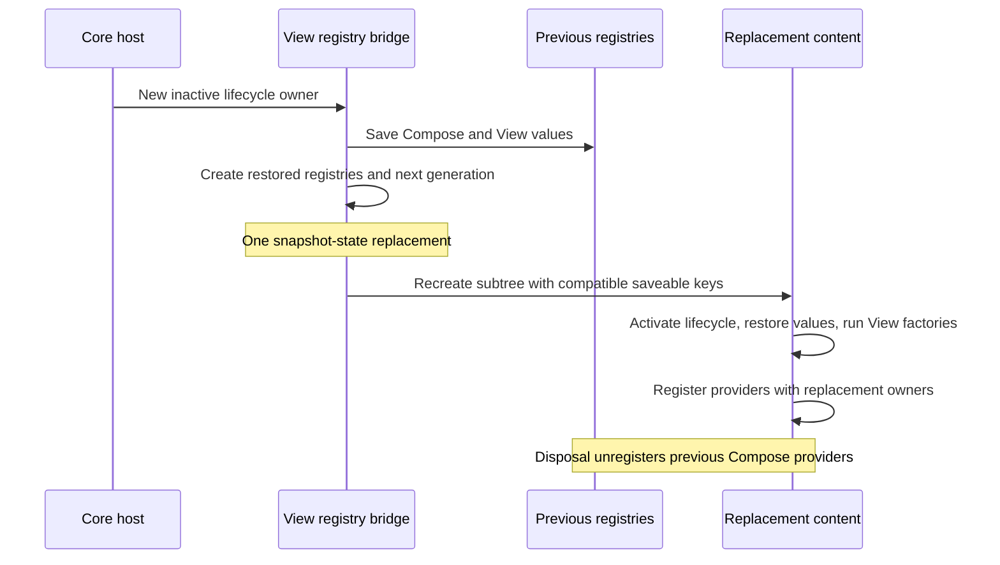

# View-compatible overlay saved-state decision

- Investigated: Compose runtime and runtime-saveable **1.9.5**, September 28, 2026.
- Decision for review: retain the internal `ContentGeneration` bridge with explicit compatibility tests.

## Constraint

Replacing an overlay's parent lifecycle creates a new overlay lifecycle and AndroidX saved-state
owner. Existing embedded View factories may have captured the old owner and registered providers
with it. The adapter recreates its content so those factories run against the new owner, restoring
both Compose and Android View state first.

`ContentGeneration` has changing equality and a constant hash. Equality makes `key` replace the
subtree; the hash preserves the generated Compose saveable keys in the replacement subtree. This
is an implementation dependency. Compose does not publicly promise that unequal keys with equal
hashes will preserve saveable identity. Keep it private to `:view-compat`.

## What the pinned source establishes

The inspected artifacts are the official
[runtime-saveable source jar](https://dl.google.com/dl/android/maven2/androidx/compose/runtime/runtime-saveable-android/1.9.5/runtime-saveable-android-1.9.5-sources.jar)
and [runtime source jar](https://dl.google.com/dl/android/maven2/androidx/compose/runtime/runtime-android/1.9.5/runtime-android-1.9.5-sources.jar).
Paths below are relative to their `commonMain/androidx/compose/runtime/` directories.

| Source | Observed behavior | Consequence |
| --- | --- | --- |
| `saveable/RememberSaveable.kt`: `rememberSaveable`, `SaveableHolder.update` | Reads `LocalSaveableStateRegistry` each composition; consumes restored state inside `remember`; a later registry change unregisters and registers the provider in a side effect. | Registry identity changes are explicitly handled in this version. They do not restore an already remembered value again. This does not establish an immutable-registry contract. |
| `saveable/SaveableStateRegistry.kt` | `consumeRestored` consumes the constructor's restored-value map. `performSave` returns saved values; it does not refill that map. `Entry.unregister` removes its provider. | Keeping a registry alive does not make current provider values available to newly created content. |
| `Composer.kt`: `updateCompositeKeyWhenWeEnterGroup`; `Composables.kt`: `key` | Movable groups incorporate the supplied key's hash into the composite hash. | The constant-hash workaround preserves descendant saveable keys in this version. This is source evidence, not a compatibility guarantee. |
| `saveable/RememberSaveable.kt` | Explicit custom saveable keys are deprecated because they bypass positional scoping. | Requiring overlay content to supply custom keys is not a suitable general replacement. |

The registry's public interface exposes saving, consuming restored values, and provider registration.
It has no operation to load a new restored-value map into an existing registry. A custom facade could
delegate to successive registries, but that alone would not solve changing generated keys when the
content subtree is recreated.

## Prototype and alternatives

The tested stable-registry prototype kept the existing subtree recreation and Android owner transfer,
but reused `previous.composeRegistry` in `ViewRegistryState.ownerFor`. This preserves the same
saveable keys, so it isolates registry lifetime from key generation.

`replacingParentRestoresViewsAndReregistersTheirProviders` passed on the existing implementation and
failed with this prototype: the counter no longer reached 2 after an increment before and after owner
replacement. Recreated content had no restored value to consume. The prototype was reverted.

This rules out simply retaining the registry. It does not prove that every stable-registry design is
impossible. Other designs need separate evaluation:

- **Keep the subtree:** provider registration can move, but existing View factories would not run
  again. Changing arbitrary embedded Views' owner bindings requires a different interoperability
  contract.
- **Use an ordinary changing key:** recreated content gets different generated saveable keys. A
  stable registry facade does not map the old positional keys to the new ones.
- **Use `ReusableContent`:** its public contract replaces remembered content and permits node reuse;
  it does not promise saveable-key preservation across different keys. The pinned implementation
  also hashes the reuse key. Replacing one undocumented hash dependency with another is insufficient.
- **Use a stable lifecycle/Android registry owner:** would change core lifecycle replacement and
  destruction semantics. This investigation leaves that larger design open.

## Decision and Compose upgrade gate

Retain the isolated workaround for now. It preserves the existing owner/factory contract and avoids
adding a custom registry implementation without a solution to positional identity. Accepting this
decision retains a dependency on implementation details that must be checked on each Compose upgrade.

Run the complete `:view-compat:connectedDebugAndroidTest` suite before accepting a
Compose runtime/saveable upgrade, including these checks:

- `changingRegistryMovesProviderWithoutConsumingRestoredStateAgain`: minimal characterization of
  registry changes, restoration consumption, and registration cleanup in the pinned runtime.
- `replacingParentRestoresViewsAndReregistersTheirProviders`: View recreation, Compose/View state
  transfer, and a subsequent saved-instance restoration.
- `repeatedParentReplacementPreservesNestedStateAndCleansUpProviders`: three replacements with
  intervening edits, two overlay namespaces, active and inactive nested saveable scopes, disposal
  of old Compose providers, and final saved-instance restoration.
- `ownerReplacementIsDiscardedWithItsSnapshot`: an abandoned replacement can consume restored
  values and register providers without changing the original registry or the next committed
  replacement; restored values are consumed once.
- Existing host tests for reordering, lifecycle caps, and independent View registries.

The device-test CI job runs this suite. If an upgrade changes key generation or
restoration behavior, investigate the source change before changing these expectations. Do not
re-record state-loss behavior as an accepted baseline.

## Upstream question (draft, not posted)

What supported composition boundary recreates arbitrary embedded `AndroidView` factories after a
saved-state owner replacement while restoring descendant `rememberSaveable` values at their existing
positional identities? The owner-replacement test above is the integration reproducer; changing its
registry transfer to reuse the existing registry demonstrates why stable identity alone is insufficient.

The smaller `SaveableRegistryContractTest` establishes that replacing `LocalSaveableStateRegistry`
already moves providers in 1.9.5. The open question is about subtree recreation and positional
identity, rather than whether a registry may change at all. No upstream report has been submitted.
